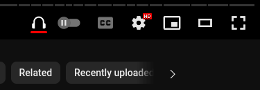
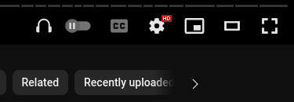
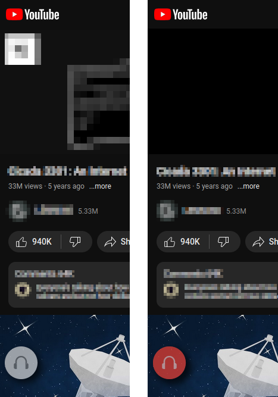

## Tube Audio Options+
### A firefox extension using manifest v3.
**This extension adds the following functionality to youtube.com and m.youtube.com:**

- Audio only playback:
	- On desktop it adds a toggle in the lower right corner of the video player to enable audio-only playback, allowing you to save battery by disabling the video rendering and bandwidth by downloading only the audio stream.
	- On mobile it adds a semi-transparent floating button on the lower left part of the screen to enable audio-only playback, you can also "leave" the page and playback should continue normally.	
	- Seamlessly switch between audio-only and video playback using the toggle on desktop or button on mobile.

- Limitations:
	- Doesn't work with live content.
	- On desktop using the YT miniplayer may have unexpected results.
	- Depending on your network connection on some rare cases it may take a couple of seconds to get the audio-only stream, until it does (and also depending if you have autoplay enabled or not) it may render the video first but just for a couple of seconds.

### Install it directly from Mozilla [here](https://addons.mozilla.org/en-US/firefox/addon/tube-audio-options/).

---

Desktop usage:  

Mobile usage:  

---

Used the main logic code from [here](https://github.com/craftwar/youtube-audio).  

The extension is heavily commented and was created for educational purposes only.  

Logo created using AI with the following prompt: "create a logo using the silhouette of a headphone with mostly a red shadow printing the letters Y and T that does not infringe copyright" @ [https://diffusionart.co](https://diffusionart.co).  

The SVG icon path was created with [https://www.svgviewer.dev/](https://www.svgviewer.dev).  

Works best alongside an adblocker like [ublock Origin](https://github.com/gorhill/uBlock).  
